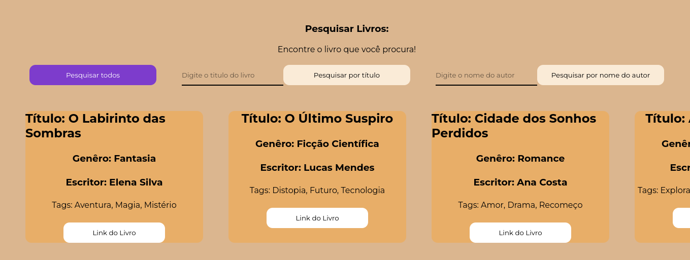

# Book Burst

Sua nova plataforma de livros, totalmente online e gratuita

## API

URL: https://book-burst.onrender.com

Utilize a URL acima para utilizar a api em uma API client (insomnia ou postman)

### Rotas
 
GET:

Rota para listar todos os livros: https://book-burst.onrender.com/books

Rota para listar livros por título: https://book-burst.onrender.com/book-title?title=

Exemplo: https://book-burst.onrender.com/book-title?title=Example

Rota para listar livros por autor: https://book-burst.onrender.com/book-writer?writer=

Exemplo: https://book-burst.onrender.com/book-writer?writer=Example

## SITE

### Inicialização

Para inicializar o site é necessário acessar o diretório "frontend" abrir o terminal e digitar o comando "npm run dev"

## Resultados

Pesquisar Todos os Livros:

